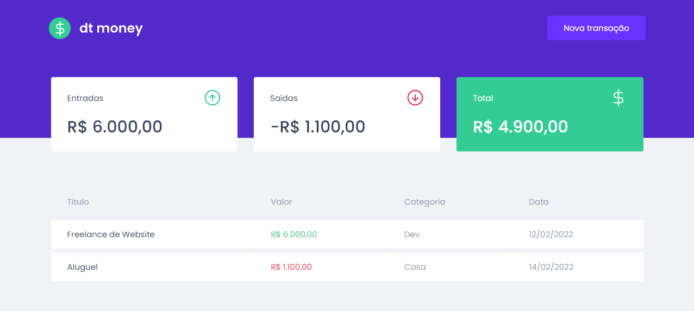

# Financial Control

  

## Um pouco do Projeto:

➡ Aplicação feita no Ignite ReactJS da RocketSeat para poder fazer um controle financeiro possuindo entradas e saídas utilizando o MirageJS como fake API para podermos receber dados fictícios e preparado para um futuro back-end

## Conteúdos

- [Overview](#overview)
  - [Como rodar o projeto](#como-rodar-o-projeto)
  - [Como utilizar](#como-utilizar-o-projeto)
  - [Screenshot](#screenshot)
- [Processo](#processo)
  - [Tecnologia utilizadas](#tecnologias-utilizadas)
  - [O que eu aprendi](#oque-eu-aprendi)
  - [Continuação do desenvolvimento](#continuacao-do-desenvolvimento)
  - [Recursos úteis](#recursos-uteis)
- [Autor](#autor)

## Overview

### Como rodar o projeto

 1. Primeiramente é necessário ter o node js instalado(caso não tenha, apenas baixe a pasta zip do projeto) 
 2. Clone o projeto com `git clone https://github.com/glsvitoria/link`
 3. Após clonar o projeto, basta apenas abrir o html principal do site e utilizar as suas funcionalidades

### Como utilizar

 1. Adicionar uma nova transação
 2. Descrever essa transação
 3. Enviar o form para ser salvo

### Screenshot

## Processo

### Tecnologias utilizadas:

### O que eu aprendi
 - Uso de contextos no React
 - Utilização do MirageJS
 - Criação de estilos com o Styled Components
 - Separação de componentes na aplicação react
 - Criação de Hooks e uso de já existentes
 - Inicialização de aplicação React como o create-react-app

### Continuação do desenvolvimento
 - Salvar todos os dados no storage do navegador
 - Hospetar o site na heroku

## Autor
- Linkedin - [Guilherme Vitória](https://www.linkedin.com/in/glsvitoria/)
- GitHub - [glsvitoria](https://github.com/glsvitoria)
- Instagram - [glsvitoria](https://www.instagram.com/glsvitoria/)
